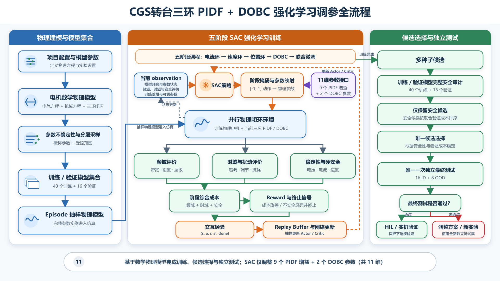
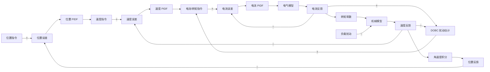
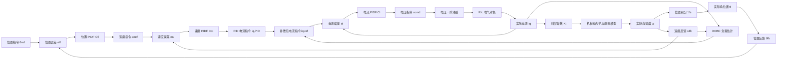
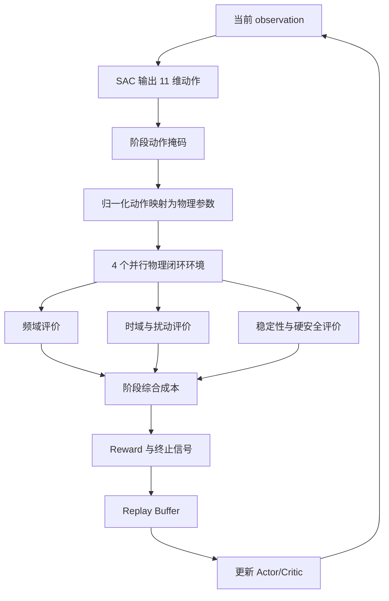
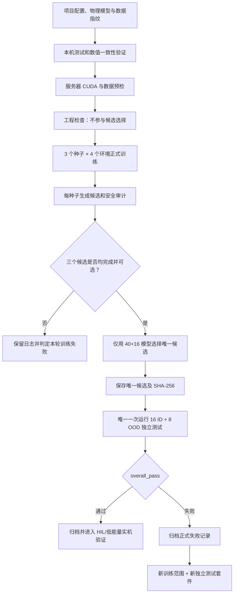

# CGS 转台三环 PIDF + DOBC 强化学习调参项目流程

本文档说明当前仓库中唯一有效的项目流程，包括控制系统、数学物理模型、SAC 训练、候选选择、一次性最终测试、第一轮正式实验结果以及进入硬件前的边界。

## 流程总览



流程图只表达可复用的项目框架，不包含某一轮实验的种子、成本、通过数量或具体结论。可编辑矢量源见 [cgs_rl_project_flowchart.svg](docs/figures/cgs_rl_project_flowchart.svg)。

> **当前状态（2026-07-29）**
>
> 第一轮正式实验已经完成。三个随机种子均完成训练并通过训练/验证安全审计，最终选择种子 `20260801`。独立最终测试的结果为域内 `16/16` 通过、OOD `3/8` 通过、总体 `19/24`，因此 `overall_pass=false`。当前候选不能直接用于实体硬件；本轮测试结果不得用于重新训练或更换候选。

## 1. 项目目标

项目面向“位置外环 - 速度中环 - 电流内环”的串级伺服控制系统，并在速度/转矩通道加入 DOBC 扰动补偿。SAC 在固定物理方程和受控不确定性范围内搜索 11 个控制参数。

强化学习输出的是经过仿真训练、验证审计和独立测试的候选参数，不是预先存在的“真实最优参数标签”。即使通过全部仿真测试，也仍需 HIL、低能量试验和实机验证。

### 1.1 三环控制结构



系统采用统一采样周期 `0.0002 s`。PIDF 的连续参数为 `Kp`、`Ki`、`Kd`，导数滤波时间常数由控制器设计配置固定，不属于 SAC 的 11 个动作参数。

## 2. 11 个控制参数

参数顺序是固定接口，不能在数据、模型或导出文件中调整：

```text
0  kppos
1  kipos
2  kdpos
3  kpspeed
4  kispeed
5  kdspeed
6  kgspeed
7  tauspeed
8  kpcurr
9  kicurr
10 kdcurr
```

| 模块 | 参数 | 主要作用 | 调整过激的主要风险 |
|---|---|---|---|
| 位置环 | `kppos` | 根据位置误差生成速度指令，提高位置响应速度和刚度 | 位置振荡、超调、速度指令过激 |
| 位置环 | `kipos` | 累积位置误差，消除长期位置偏差 | 积分饱和、调节时间变长 |
| 位置环 | `kdpos` | 根据误差变化率提供阻尼 | 放大编码器噪声、指令抖动 |
| 速度环 | `kpspeed` | 根据速度误差生成电流/转矩指令 | 速度振荡、电流指令过大 |
| 速度环 | `kispeed` | 消除负载扰动引起的稳态速度误差 | 超调和低频振荡 |
| 速度环 | `kdspeed` | 增加速度环阻尼并抑制快速变化 | 放大测速噪声 |
| DOBC | `kgspeed` | 调整扰动观测补偿强度 | 模型失配时可能过补偿 |
| DOBC | `tauspeed` | 调整扰动估计滤波速度和带宽 | 过小放大噪声，过大响应缓慢 |
| 电流环 | `kpcurr` | 快速跟踪电流指令，直接影响转矩响应 | 电流振荡、驱动输出剧烈 |
| 电流环 | `kicurr` | 消除电阻压降等造成的稳态电流误差 | 电流超调和积分饱和 |
| 电流环 | `kdcurr` | 增加电流环阻尼 | 对电流噪声敏感 |

参数使用归一化坐标表示。严格为正且跨数量级的参数采用对数映射，可为零的微分增益和 DOBC 增益采用线性映射；每个动作还受单步调整幅度约束。

参数上下界、初始值、映射方式和来源以 `data/processed/controller_parameter_space.json` 为准。

## 3. 数学物理模型与模型集合

### 3.1 唯一训练后端

当前唯一训练后端是 `physics`。项目采用单轴 FOC 解耦后的转矩电流模型，记实际转矩电流为 `iq`。FOC 解耦后的电气方程不再显式包含反电动势和 `dq` 轴交叉耦合项。代码同时支持粘性摩擦和完整 LuGre 摩擦；由于库仑摩擦与最大静摩擦尚未辨识，当前正式配置仍使用粘性兼容模式。

完整控制链如下：



#### 3.1.1 采样周期

三环控制和时域仿真使用统一采样周期：

$$
T_s=0.0002\ \mathrm{s}
$$

#### 3.1.2 电压执行一阶滞后

电流控制器首先输出电压指令 `ucmd`。电压经过一阶执行滞后后形成实际作用电压 `ua`：

$$
t_i\frac{\mathrm{d}u_a(t)}{\mathrm{d}t}+u_a(t)=u_{\mathrm{cmd}}(t)
$$

对应传递函数为：

$$
G_d(s)=\frac{U_a(s)}{U_{\mathrm{cmd}}(s)}
=\frac{1}{t_i s+1}
$$

离散实现为：

$$
u_a[k]=u_a[k-1]
+\frac{T_s}{t_i+T_s}
\left(u_{\mathrm{cmd}}[k]-u_a[k-1]\right)
$$

配置项 `current_delay_s` 在当前代码中表示一阶滞后时间常数，不是纯时间延迟 `exp(-t_i s)`，也不是电流测量延迟。

| 符号 | 当前值或单位 | 含义 |
|---|---:|---|
| `ucmd` | V | 电流 PIDF 输出的电压指令 |
| `ua` | V | 经过一阶滞后后实际作用于电气方程的电压 |
| `ti` | `0.0002 s` | 电压执行一阶滞后时间常数 |

#### 3.1.3 电气对象

FOC 解耦后的 `q` 轴电气方程为：

$$
L\frac{\mathrm{d}i_q(t)}{\mathrm{d}t}+R i_q(t)=u_a(t)
$$

实际作用电压到电流的传递函数为：

$$
G_e(s)=\frac{I_q(s)}{U_a(s)}
=\frac{1}{Ls+R}
$$

将电压一阶滞后与 `R-L` 电气对象串联，得到电流环被控对象：

$$
P_i(s)=G_d(s)G_e(s)
=\frac{1}{(t_i s+1)(Ls+R)}
$$

离散电流更新方程为：

$$
i_q[k+1]=i_q[k]
+T_s\frac{u_a[k]-R i_q[k]}{L}
$$

| 参数 | 标称值 | 单位 | 不确定范围 | 物理含义 |
|---|---:|---|---:|---|
| `L` | 0.002707 | H | ±5% | 等效电感，决定电流变化速度和高频衰减 |
| `R` | 4.993 | Ω | ±5% | 等效电阻，与电感共同决定电气时间常数 |
| `ti` | 0.0002 | s | ±10% | 电压执行一阶滞后时间常数 |
| `iq` | 动态量 | A | — | 实际转矩电流 |
| `Pi(s)` | 动态对象 | A/V | — | 电压指令到实际电流的完整电气对象 |

电气时间常数为：

$$
\tau_e=\frac{L}{R}
\approx 5.42\times10^{-4}\ \mathrm{s}
$$

当前模型没有单独的电流传感器动态，电流环采用单位反馈。

#### 3.1.4 电流 PIDF 与电流闭环

电流误差为：

$$
e_i(t)=i_{q,\mathrm{ref}}(t)-i_q(t)
$$

电流控制器为：

$$
C_i(s)=K_{pi}+\frac{K_{ii}}{s}
+\frac{K_{di}s}{T_{fi}s+1}
$$

电流控制器输出电压指令：

$$
U_{\mathrm{cmd}}(s)=C_i(s)E_i(s)
$$

电流环开环传递函数为：

$$
L_i(s)=C_i(s)P_i(s)
$$

电流闭环传递函数为：

$$
T_i(s)=\frac{I_q(s)}{I_{q,\mathrm{ref}}(s)}
=\frac{L_i(s)}{1+L_i(s)}
$$

因此 `Ci(s)Pi(s)` 是电流环开环，`Ti(s)` 才是电流指令到实际电流的闭环。

| 参数 | 训练初值 | 调整范围 | 按当前信号定义的单位 | 含义 |
|---|---:|---:|---|---|
| `Kpi` | 7.61456 | 1.90364～30.4583 | V/A | 电流比例增益 |
| `Kii` | 14044.89 | 3511.22～56179.56 | V/(A·s) | 电流积分增益 |
| `Kdi` | 0.000151487 | 0～0.000605948 | V·s/A | 电流微分增益 |
| `Tfi` | 0.0002 | 固定 | s | 电流微分低通滤波时间常数 |

上述数值是训练初始值，不是强化学习输出的最终候选参数。

#### 3.1.5 电磁转矩

转矩电流通过转矩常数产生电磁转矩：

$$
\tau_e(t)=K_t i_q(t)
$$

| 参数或信号 | 标称值 | 单位 | 不确定范围 | 含义 |
|---|---:|---|---:|---|
| `Kt` | 0.1633 | N·m/A | ±5% | 每安培转矩电流产生的电磁转矩 |
| `iq` | 动态量 | A | — | 实际转矩电流 |
| `τe` | 动态量 | N·m | — | 电磁转矩 |

如果控制框图已经将 `Kt` 单独画成方框，后续机械方框必须写成 `1/(Js+B)`；如果机械方框写成 `Kt/(Js+B)`，则不能再单独画一次 `Kt`。

#### 3.1.6 机械对象

当前粘性兼容模式下，电机和负载的机械方程为：

$$
J\frac{\mathrm{d}\omega(t)}{\mathrm{d}t}
=K_t i_q(t)-B\omega(t)-\tau_L(t)
$$

其中正的负载转矩 `τL` 表示阻碍运动的外部扰动。忽略负载扰动时，电流到角速度的传递函数为：

$$
G_m(s)=\frac{\Omega(s)}{I_q(s)}
=\frac{K_t}{Js+B}
$$

若 `Kt` 已作为独立方框，则机械本体为：

$$
G_J(s)=\frac{\Omega(s)}{\tau_e(s)}
=\frac{1}{Js+B}
$$

负载扰动到角速度的传递函数为：

$$
\frac{\Omega(s)}{\tau_L(s)}
=-\frac{1}{Js+B}
$$

离散机械状态更新为：

$$
\omega[k+1]=\omega[k]
+T_s\frac{K_t i_q[k+1]-B\omega[k]-\tau_L[k]}{J}
$$

| 参数或信号 | 标称值 | 单位 | 不确定范围 | 含义 |
|---|---:|---|---:|---|
| `J` | 0.00221 | kg·m² | ±10% | 电机及负载折算到电机轴的总转动惯量 |
| `B` | 0.0237 | N·m·s/rad | ±10% | 粘性摩擦系数，阻力矩为 `Bω` |
| `Kt` | 0.1633 | N·m/A | ±5% | 转矩常数 |
| `τL` | 外部输入 | N·m | — | 负载扰动转矩 |
| `ω` | 动态量 | rad/s | — | 实际机械角速度 |

机械时间常数为：

$$
\tau_m=\frac{J}{B}\approx0.09325\ \mathrm{s}
$$

完整 LuGre 模式启用后，机械方程改为：

$$
J\dot\omega=K_t i_q-\tau_f-\tau_L
$$

$$
g(\omega)=\tau_c+(\tau_s-\tau_c)
\exp\left[-\left(\frac{|\omega|}{\omega_s}\right)^\alpha\right]
$$

$$
\dot z=\omega-\frac{\sigma_0|\omega|}{g(\omega)}z
$$

$$
\tau_f=\sigma_0z+\sigma_1\dot z+\sigma_2\omega,
\qquad \sigma_2=B
$$

其中 `z` 是随时间更新的鬃毛变形内部状态。仿真内核在每个采样周期内固定当前速度，对 `z` 使用解析离散更新，避免高速度或较大 `σ0` 下的显式欧拉数值不稳定。完整 LuGre 只进入非线性时域仿真；频域 Bode 评价仍采用 `Kt/(Js+B)` 的标称滑动线性近似。

#### 3.1.7 位置运动学

角位置由角速度积分得到：

$$
\frac{\mathrm{d}\theta(t)}{\mathrm{d}t}=\omega(t)
$$

对应传递函数为：

$$
G_{\theta\omega}(s)=\frac{\Theta(s)}{\Omega(s)}
=\frac{1}{s}
$$

离散实现使用更新后的角速度：

$$
\theta[k+1]=\theta[k]+T_s\omega[k+1]
$$

| 参数或信号 | 单位 | 含义 |
|---|---|---|
| `θ` | rad | 连续展开的实际角位置 |
| `ω` | rad/s | 实际机械角速度 |
| `1/s` | s | 角速度到角位置的积分环节 |

当前位置状态允许连续旋转，没有位置硬限位；只有位置控制误差会映射到 `[-π, π)`。

#### 3.1.8 速度与位置测量

位置反馈使用一阶测量滞后：

$$
t_\theta\frac{\mathrm{d}\theta_{\mathrm{fb}}(t)}{\mathrm{d}t}
+\theta_{\mathrm{fb}}(t)=\theta(t)
$$

$$
H_\theta(s)=\frac{\Theta_{\mathrm{fb}}(s)}{\Theta(s)}
=\frac{1}{t_\theta s+1}
$$

速度反馈同样使用一阶测量滞后：

$$
t_\omega\frac{\mathrm{d}\omega_{\mathrm{fb}}(t)}{\mathrm{d}t}
+\omega_{\mathrm{fb}}(t)=\omega(t)
$$

$$
H_\omega(s)=\frac{\Omega_{\mathrm{fb}}(s)}{\Omega(s)}
=\frac{1}{t_\omega s+1}
$$

一阶测量环节的统一离散形式为：

$$
x_{\mathrm{fb}}[k]=x_{\mathrm{fb}}[k-1]
+\frac{T_s}{t_x+T_s}
\left(x[k]-x_{\mathrm{fb}}[k-1]\right)
$$

| 参数或信号 | 标称值 | 单位 | 不确定范围 | 含义 |
|---|---:|---|---:|---|
| `tω` | 0.0002 | s | ±10% | 速度反馈一阶滞后时间常数 |
| `tθ` | 0.0002 | s | ±10% | 位置反馈一阶滞后时间常数 |
| `ωfb` | 动态量 | rad/s | — | 速度控制器使用的反馈速度 |
| `θfb` | 动态量 | rad | — | 位置控制器使用的反馈位置 |

启用编码器效应时，位置先加入半个 LSB 范围内的噪声并量化：

$$
\theta_{\mathrm{obs}}[k]
=Q\left(\theta_{\mathrm{fb}}[k]+n_q[k]\Delta\theta\right)
$$

再通过位置差分计算编码器速度：

$$
\omega_{\mathrm{enc}}[k]
=\frac{\theta_{\mathrm{obs}}[k]-\theta_{\mathrm{obs}}[k-1]}{T_s}
$$

| 编码器参数 | 当前值 | 含义 |
|---|---:|---|
| 暂定分辨率 | 23 bit | 当前仿真需求值，尚未确认为真实硬件规格 |
| 每转计数 | 8,388,608 | `2^23` |
| 位置 LSB | `7.49014e-7 rad` | 一个计数对应的角度 |
| `nq` | `[-0.5, 0.5]` | 半个 LSB 范围内的均匀噪声 |

默认训练和评价路径关闭编码器量化与噪声。

#### 3.1.9 三环统一 PIDF

位置环、速度环和电流环均采用带滤波微分的连续参数 PIDF：

$$
C_\ell(s)=K_{p\ell}+\frac{K_{i\ell}}{s}
+\frac{K_{d\ell}s}{T_{f\ell}s+1},
\qquad \ell\in\{\theta,\omega,i\}
$$

等价有理式为：

$$
C_\ell(s)=
\frac{
(K_{p\ell}T_{f\ell}+K_{d\ell})s^2
+(K_{p\ell}+K_{i\ell}T_{f\ell})s
+K_{i\ell}
}{
T_{f\ell}s^2+s
}
$$

运行时采用以下离散实现：

$$
\dot e_{\mathrm{raw}}[k]
=\frac{e[k]-e[k-1]}{T_s}
$$

$$
\alpha_f=\frac{T_s}{T_f+T_s}
$$

$$
d[k]=d[k-1]
+\alpha_f\left(\dot e_{\mathrm{raw}}[k]-d[k-1]\right)
$$

$$
I_{\mathrm{cand}}[k]=I[k-1]+K_i e[k]T_s
$$

$$
u_{\mathrm{raw}}[k]
=K_p e[k]+I_{\mathrm{cand}}[k]+K_d d[k]
$$

$$
u[k]=\operatorname{clip}
\left(u_{\mathrm{raw}}[k],u_{\min},u_{\max}\right)
$$

当控制量已饱和且当前误差会推动控制量进一步进入饱和区时，积分状态停止更新。这是条件积分抗饱和；微分项作用于误差。

#### 3.1.10 速度环

速度误差和速度 PIDF 输出为：

$$
e_\omega(t)=\omega_{\mathrm{ref}}(t)-\omega_{\mathrm{fb}}(t)
$$

$$
i_{q,\mathrm{PID}}(s)=C_\omega(s)E_\omega(s)
$$

速度环前向通道为：

$$
F_\omega(s)
=C_\omega(s)T_i(s)\frac{K_t}{Js+B}
$$

速度环开环传递函数为：

$$
L_\omega(s)
=C_\omega(s)T_i(s)
\frac{K_t}{Js+B}
\frac{1}{t_\omega s+1}
$$

速度指令到实际角速度的闭环传递函数为：

$$
T_{\omega,a}(s)
=\frac{\Omega(s)}{\Omega_{\mathrm{ref}}(s)}
=\frac{F_\omega(s)}
{1+F_\omega(s)H_\omega(s)}
$$

| 参数 | 训练初值 | 调整范围 | 按当前信号定义的单位 | 含义 |
|---|---:|---:|---|---|
| `Kpω` | 3.40560 | 0.851401～13.6224 | A·s/rad | 速度比例增益 |
| `Kiω` | 36.5216 | 9.13040～146.086 | A/rad | 速度积分增益 |
| `Kdω` | 0.000677523 | 0～0.00271009 | A·s²/rad | 速度微分增益 |
| `Tfω` | 0.000795775 | 固定 | s | 速度微分低通滤波时间常数 |

#### 3.1.11 DOBC 负载扰动观测与补偿

根据机械方程，负载转矩可写成：

$$
\tau_L=K_t i_q-J\dot\omega-B\omega
$$

DOBC 使用标称参数计算未滤波的负载估计：

$$
\widetilde{\tau}_L
=K_{t,n}i_q
-\left(
J_n\frac{\mathrm{d}\omega_{\mathrm{fb}}}{\mathrm{d}t}
+B_n\omega_{\mathrm{fb}}
\right)
$$

扰动估计低通滤波器为：

$$
Q_D(s)=\frac{1}{\tau_Ds+1}
$$

$$
\widehat{\tau}_L(s)
=Q_D(s)\widetilde{\tau}_L(s)
$$

补偿后的电流指令为：

$$
i_{q,\mathrm{ref}}
=\operatorname{sat}
\left[
i_{q,\mathrm{PID}}
+\frac{K_G}{K_{t,n}}\widehat{\tau}_L
\right]
$$

| 参数 | 当前初值 | 调整范围 | 单位 | 含义 |
|---|---:|---:|---|---|
| `KG` / `kgspeed` | 1.0 | 0～1.2 | 无量纲 | DOBC 补偿增益 |
| `τD` / `tauspeed` | 0.002 | 0.0008～0.01 | s | 扰动估计低通滤波时间常数 |
| `Kt,n` | 0.1633 | 使用标称值 | N·m/A | 标称逆模型转矩常数 |
| `Jn` | 0.00221 | 使用标称值 | kg·m² | 标称逆模型转动惯量 |
| `Bn` | 0.0237 | 使用标称值 | N·m·s/rad | 标称逆模型粘性摩擦系数 |
| `τ̃L` | 动态量 | — | N·m | 未滤波负载转矩估计 |
| `τ̂L` | 动态量 | — | N·m | 滤波后的负载转矩估计 |

DOBC 是并联到速度 PIDF 输出端的补偿通道，不是串联的 ZOH。当前三环线性开环 Bode 评价不包含 DOBC，DOBC 效果通过负载阶跃时域仿真评价。

#### 3.1.12 位置环

位置误差采用最短角度误差：

$$
e_\theta
=\left[
(\theta_{\mathrm{ref}}-\theta_{\mathrm{obs}}+\pi)
\bmod 2\pi
\right]-\pi
$$

位置 PIDF 输出速度指令：

$$
\omega_{\mathrm{ref}}(s)=C_\theta(s)E_\theta(s)
$$

位置环前向通道为：

$$
F_\theta(s)
=C_\theta(s)T_{\omega,a}(s)\frac{1}{s}
$$

位置环开环传递函数为：

$$
L_\theta(s)
=C_\theta(s)T_{\omega,a}(s)
\frac{1}{s}
\frac{1}{t_\theta s+1}
$$

位置指令到实际角位置的闭环传递函数为：

$$
T_{\theta,a}(s)
=\frac{\Theta(s)}{\Theta_{\mathrm{ref}}(s)}
=\frac{F_\theta(s)}
{1+F_\theta(s)H_\theta(s)}
$$

| 参数 | 训练初值 | 调整范围 | 按当前信号定义的单位 | 含义 |
|---|---:|---:|---|---|
| `Kpθ` | 62.1367 | 15.5342～248.547 | 1/s | 位置比例增益 |
| `Kiθ` | 780.833 | 195.208～3123.33 | 1/s² | 位置积分增益 |
| `Kdθ` | 0.0494468 | 0～0.197787 | 无量纲 | 位置微分增益 |
| `Tfθ` | 0.00318310 | 固定 | s | 位置微分低通滤波时间常数 |

#### 3.1.13 三环嵌套闭环关系

完整的三环关系为：

$$
L_i=C_iP_i,
\qquad
T_i=\frac{L_i}{1+L_i}
$$

$$
L_\omega
=C_\omega T_i
\frac{K_t}{Js+B}
H_\omega
$$

$$
T_{\omega,a}
=\frac{
C_\omega T_i K_t/(Js+B)
}{
1+C_\omega T_i K_t H_\omega/(Js+B)
}
$$

$$
L_\theta
=C_\theta T_{\omega,a}
\frac{1}{s}
H_\theta
$$

$$
T_{\theta,a}
=\frac{
C_\theta T_{\omega,a}/s
}{
1+C_\theta T_{\omega,a}H_\theta/s
}
$$

速度环内部必须包含已经闭合的电流环 `Ti`；位置环内部必须包含已经闭合的实际速度环 `Tω,a`。三个控制环不是三个彼此独立的对象。

#### 3.1.14 频率、幅值和相位

对任意传递函数 `G(s)`，令：

$$
s=j2\pi f
$$

即可得到复数频率响应：

$$
G(f)=G(j2\pi f)
$$

线性幅值、分贝幅值和相位分别为：

$$
A(f)=\left|G(j2\pi f)\right|
$$

$$
M(f)=20\log_{10}
\left|G(j2\pi f)\right|
\quad \mathrm{dB}
$$

$$
\phi(f)=
\arg\left[G(j2\pi f)\right]
\frac{180}{\pi}
$$

因此频率、幅值和相位不是另一套外部数据，而是由上述电气、机械、测量和控制器公式在不同频率下计算得到的结果。

observation 中的 96 维物理模型频响指纹来自以下三个基础对象：

$$
P_i(s)=\frac{1}{(Ls+R)(t_i s+1)}
$$

$$
P_{\omega,\mathrm{obs}}(s)
=\frac{K_t}{(Js+B)(t_\omega s+1)}
$$

$$
P_{\theta,\mathrm{obs}}(s)
=\frac{1}{s(t_\theta s+1)}
$$

每个对象取 16 个对数频率点，每个点包含幅值和相位，因此总维数为：

$$
3\times16\times2=96
$$

这些频响全部由当前 episode 的物理模型参数计算，不是实测频响数据。

#### 3.1.15 仿真限幅与保护

| 项目 | 当前值 | 实际作用 |
|---|---:|---|
| 电压限幅 | ±7.2 V | 限制电流 PIDF 输出 |
| 电流指令限幅 | ±0.7 A | 限制速度 PIDF 和 DOBC 后的电流指令 |
| 电流状态数值保护 | ±0.875 A | 电气状态的额外保护 |
| 位置环速度指令限幅 | ±3.44515 rad/s | 限制位置 PIDF 输出 |
| 速度安全审计值 | 4.82321 rad/s | 用于安全指标，不直接夹紧速度 |
| 速度终止阈值 | 5.78785 rad/s | 超过后终止该次仿真 |
| 扰动负载阶跃 | 0.040825 N·m | 扰动场景中的外部阻力矩 |
| 扰动开始时间 | 0.15 s | 负载阶跃施加时刻 |

这些数值定义的是当前仿真有效范围，不能直接解释为已经确认的真实电机或驱动器硬件额定值。

#### 3.1.16 LuGre 实现状态与临时激活范围

| 参数 | 当前值 | 单位 | 当前状态 |
|---|---:|---|---|
| 摩擦刚度 `σ0` | 187.0 | N·m/rad | 已激活；导师给定但尚未实机校核 |
| 摩擦阻尼 `σ1` | 2.42 | N·m·s/rad | 已激活；导师给定、高风险待辨识 |
| 粘性摩擦 `σ2=B` | 0.0237 | N·m·s/rad | 已激活；只在 LuGre 摩擦力矩内计算一次 |
| Stribeck 速度 `ωs` | 0.05061 | rad/s | 已激活；导师给定但尚未实机校核 |
| 库仑摩擦 `τc` | 0.015 | N·m | 仿真启动假设，未实机辨识，采样范围 `±10%` |
| 最大静摩擦 `τs` | 0.020 | N·m | 仿真启动假设，未实机辨识，采样范围 `±10%` |
| Stribeck 指数 `α` | 2.0 | — | 配置值 |
| 初始鬃毛状态 `z(0)` | 0.0 | rad | 每个场景的默认初始值 |

当前仿真启用完整 LuGre 摩擦力矩：

$$
\tau_f=\sigma_0z+\sigma_1\dot z+\sigma_2\omega
$$

完整 LuGre 方程、稳定离散状态更新、摩擦转矩轨迹、鬃毛状态轨迹和正负速度反转测试均已实现。2026-08-03 起按用户授权使用上述临时值启动仿真；它们满足 `τs >= τc > 0`，但不代表已经完成实机辨识，也不允许用于硬件参数声明。

物理模型参数文件已由 11 维扩展为 13 维。当前 `τc` 与 `τs` 均按 `±10%` 采样，最坏情况下仍满足 `τs,min=0.018 N·m > τc,max=0.0165 N·m`。取得实机数据后必须替换或确认临时标称值与不确定范围，并从新实验目录重新训练。

每个 episode 使用一组完整的物理参数实例。三环频域响应、时域响应、扰动响应、安全指标和 Reward 均由该数学物理模型计算。

### 3.2 参数不确定性与分层采样

模型集合按 `config/motor_physics.json` 中的范围进行固定、可复现的分层采样。电感、电阻和转矩常数使用 `±5%` 范围；延迟、惯量和配置中的其他不确定量主要使用 `±10%` 范围。

分层采样先生成彼此独立的训练、验证和测试模型集合；训练期间只从训练集合抽样完整物理模型，不会从实测数据构造 observation，也不会把不同模型的参数拼接成一个对象。

### 3.3 模型集合隔离

| 集合 | 数量 | 用途 | 是否参与 SAC 更新 |
|---|---:|---|---|
| 训练物理电机 | 40 | 在线交互、Reward 和 Replay Buffer | 是 |
| 验证物理电机 | 16 | 周期审计、阶段候选和最终候选选择 | 否 |
| 域内最终测试电机 | 16 | 独立泛化验收 | 否 |
| OOD 压力测试电机 | 8 | 极端模拟工况下的硬安全测试 | 否 |

训练/验证模型由固定种子 `20260722` 生成。域内测试模型使用独立种子 `20260723`，并检查与训练/验证参数矩阵不存在重合。8 个 OOD 模型由预先声明的不利参数角点构成。

最终测试集禁止用于：

- Reward 计算
- Replay Buffer 生成
- 早停
- 超参数选择
- 候选选择
- 训练或验证审计

### 3.4 训练外离线模型误差诊断

仓库保留实测三环频响，仅用于训练流程之外的离线现实性检查和模型误差诊断。实测频响不进入 observation、Reward、Replay Buffer、运行时审计、候选筛选或最终测试判定，也不参与 episode 物理模型的生成与抽样；主训练链对实测频响数据没有依赖。

## 4. 软件与并行结构

时域物理仿真使用 Numba 编译的 `float64` 数值内核。默认正式训练结构为：

```text
1 个 launcher
└── 3 个独立种子进程，各运行 1 个 SAC learner
    └── 每个 learner 使用 4 个 SubprocVecEnv worker

合计：3 个 learner + 12 个物理环境进程
```

- 物理仿真主要运行在 CPU。
- Actor/Critic 更新运行在 GPU。
- 每个数值进程限制为单线程，防止隐藏线程争用。
- 每个向量环境 step 产生 4 条 transition。
- 配置保持每条 transition 对应 1 次梯度更新。
- 三个种子的模型、Replay Buffer、日志和候选完全独立。
- `3 × 4` 是正式配置的默认值，命令行参数可以为工程检查覆盖并行种子数和环境数。

每个 worker 在 episode reset 时从 40 个训练电机中随机抽取 1 个完整物理电机实例；该 episode 的三环评价始终使用同一组物理参数，不会把多个电机的参数混合成一个对象。

并行化会改变经验采集顺序，因此它定义了当前正式实验，不用于无审计地继续旧的单环境 checkpoint。

## 5. SAC 交互流程



observation 是 SAC 每一步接收到的状态，由以下七组数值组成：

| observation 项 | 维数 | 具体含义 |
|---|---:|---|
| `sampled_frf` | 96 | 当前物理模型生成的三环频响：3 个环 × 16 个对数频率点 × 幅值/相位；不是实测频响 |
| `friction_context` | 6 | 当前模型的 `σ0、σ1、σ2、τc、τs、ωs` 相对标称不确定范围；粘性兼容模式下全为零 |
| `parameter_state` | 11 | 当前 9 个 PIDF 增益和 2 个 DOBC 参数的归一化状态 |
| `metrics` | 23 | 三环各 6 个频域指标，加上 5 个三环层级、DOBC 与综合成本指标 |
| `time_metrics` | 27 | 三环各 8 个时域指标，加上速度环扰动峰值、扰动 IAE 和恢复时间 |
| `action_mask` | 11 | 11 个参数的阶段开关；表示当前训练阶段允许调整哪些参数 |
| `stage` | 5 | 电流环、速度环、位置环、DOBC、联合微调五个阶段的独热标识 |

observation 合计 `96 + 6 + 11 + 23 + 27 + 11 + 5 = 179` 维，不包含实测频响或固定测量上下文。

该 179 维纯物理 observation 是新的训练协议。旧的 878 维和 173 维模型、Replay Buffer、transition 数据及环境状态与本协议不兼容；输入指纹和环境状态版本检查会拒绝旧 checkpoint，必须开启新的实验目录重新训练。

安全候选的单步 Reward 为：

```text
10 × 成本改善
- 0.02 × 当前绝对成本
- 0.002 × 动作平方和
```

如果快速评价或周期性完整审计判定不安全：

```text
Reward = -100 - 动作惩罚
```

并立即结束当前 episode。每个 episode 最多 32 步。每个 worker 累计 64 个本地环境步时执行运行时审计：频域检查覆盖全部 40 个训练模型和 16 个验证模型，时域检查使用 4 个运行时探针模型（标称模型和 3 个验证模型）。阶段 finalist、种子候选和多种子候选选择时，才执行覆盖全部 56 个模型的非线性时域安全审计。

## 6. 五阶段课程训练

| 阶段 | SAC 可调整的参数 | 阶段步数 | 其他参数 |
|---|---|---:|---|
| 1. 电流环 | `kpcurr, kicurr, kdcurr` | 30,000 | 保持初始值 |
| 2. 速度环 | `kpspeed, kispeed, kdspeed` | 40,000 | 电流环使用上一阶段结果 |
| 3. 位置环 | `kppos, kipos, kdpos` | 40,000 | 电流环和速度环固定 |
| 4. DOBC | `kgspeed, tauspeed` | 30,000 | 三环 PIDF 固定 |
| 5. 联合微调 | 全部 11 个参数 | 120,000 | 全部参数参与联合调整 |
| 合计 |  | 260,000 | 每个随机种子 |

训练从内环到外环逐步建立稳定基础，再单独调整扰动补偿，最后联合优化全部参数。

五个阶段连续使用同一个 SAC 模型和同一个 Replay Buffer；阶段切换只更新环境阶段、动作掩码和该阶段的基准参数，不会为每个阶段重新创建一个独立智能体。

表中的 260,000 步是每个 learner 的 aggregate environment timesteps；4 个 worker 共同产生这些 transition，不是每个 worker 各运行 260,000 步。

正式配置还包括：

- Policy：`MultiInputPolicy`
- 学习率：`3e-4`
- Replay Buffer：50,000 条 transition
- 学习开始：2,000 条 transition
- Batch size：256
- `tau`：`0.005`
- `gamma`：`0.98`
- Actor/Critic 网络：`256 × 256`
- checkpoint 间隔：10,000 步
- 验证间隔：10,000 步
- checkpoint 保留最近 2 份
- 进度日志间隔：1,000 步

## 7. 性能评价、Reward 与最终验收

### 7.1 训练评价

训练阶段同时计算：

| 类别 | 主要指标 |
|---|---|
| 频域 | 交越频率、带宽、相位裕度、增益裕度、灵敏度峰值、闭环稳定性 |
| 时域 | 上升时间、调节时间、超调、稳态误差、IAE、控制峰值、RMS 和变化率 |
| 抗扰 | 扰动速度峰值、扰动 IAE、恢复时间、DOBC 残差和激进程度 |
| 层级 | 电流/速度交越频率比、速度/位置交越频率比 |
| 硬安全 | 电压、电流、速度限制以及数值有效性 |

训练/验证候选的主要安全门槛为：

| 检查对象 | 门槛 |
|---|---|
| 40 个训练模型 | 全部稳定；电流/速度相位裕度 `>= 35 deg`，位置相位裕度 `>= 40 deg` |
| 40 个训练模型 | 增益裕度 `>= 3 dB`，灵敏度峰值 `<= 2.5` |
| 16 个验证模型 | 全部稳定；相位裕度 `>= 20 deg`，增益裕度 `>= 3 dB`，灵敏度峰值 `<= 3` |
| 全部相关时域模型 | 电压、电流、速度限制比均 `<= 1.001` |
| 三环层级 | 电流/速度交越频率比 `>= 4`，速度/位置交越频率比 `>= 3` |

三环目标交越频率为：

```text
电流环 400 Hz
速度环  40 Hz
位置环  10 Hz
```

### 7.2 最终测试硬门槛

24 个最终测试模型都必须满足：

| 项目 | 门槛 |
|---|---:|
| 闭环稳定 | 必须为真 |
| 电压、电流、速度限制比 | `<= 1.001` |
| 增益裕度 | `>= 3 dB` |
| 灵敏度峰值 | `<= 3` |
| 电流/速度交越频率比 | `>= 4` |
| 速度/位置交越频率比 | `>= 3` |
| 电流环相位裕度 | `>= 20 deg` |
| 速度环相位裕度 | `>= 20 deg` |
| 位置环相位裕度 | `>= 25 deg` |

16 个域内模型还必须全部满足：

| 域内性能项目 | 门槛 |
|---|---:|
| 电流/速度/位置调节时间 | `<= 0.005 / 0.1 / 0.3 s` |
| 电流/速度/位置超调率 | `<= 0.15 / 0.10 / 0.20` |
| 最大稳态误差 | `<= 0.02` |
| 标准扰动速度峰值 | `<= 0.08 rad/s` |
| 标准扰动恢复时间 | `<= 0.25 s` |

OOD 模型允许报告性能退化，但稳定性、裕度、带宽层级和硬限制仍然是强制条件。

仿真基础限制和最终测试 `1.001` 容差线为：

| 项目 | 仿真硬限制 | 最终测试容差线 |
|---|---:|---:|
| 电压 | `7.2 V` | `7.2072 V` |
| 电流 | `0.7 A` | `0.7007 A` |
| 速度 | `4.82320675 rad/s` | 约 `4.82803 rad/s` |

数值终止速度为 `5.78784810 rad/s`。OOD 压力场景还使用 `0.08165 N*m` 负载以及编码器量化/噪声；域内标准场景不启用编码器效应。这些仿真边界尚未确认为真实电机和驱动器的额定值。

## 8. 正式实验生命周期



### 8.1 服务器入口

完整服务器命令见 `SERVER_TRAINING.md` 和 `SERVER_RELEASE.md`。核心入口为：

```bash
python scripts/check_server_runtime.py --device cuda
python -u scripts/train_all_seeds.py --device cuda
python scripts/select_final_candidate.py
```

工程检查必须使用独立输出目录，且结果不能参与正式候选选择。

### 8.2 checkpoint 与恢复

checkpoint 保存：

- SAC 模型和优化器
- Replay Buffer
- Python、NumPy、PyTorch 和 CUDA 随机状态
- 每个并行环境的完整状态和随机状态
- 当前 observation
- 训练阶段和阶段进度
- 候选池
- 源码、配置和训练数据指纹
- 环境数量

恢复时必须使用相同源码、配置、训练数据和环境数。若输入指纹不同，程序必须拒绝恢复并开启新实验目录。

### 8.3 唯一候选选择

三个正式种子完成后，`scripts/select_final_candidate.py`：

1. 发现三个 `seed_candidate.npz`；
2. 检查种子不重复、输入指纹一致且候选来自已完成的正式训练；
3. 在全部 40 个训练模型和 16 个验证模型上复核频域和非线性时域硬安全；
4. 先排除不安全候选；
5. 在安全候选中按联合验证成本从低到高排序，成本相同时按种子号排序；
6. 生成唯一 `final_candidate.npz`。

输出位于：

```text
outputs/sac_training/selection/
├── candidate_leaderboard.json
├── final_candidate.npz
└── final_candidate_audit.json
```

### 8.4 候选锁定与一次性最终测试

候选选择完成后停止训练和候选选择，并保存候选 SHA-256：

```bash
sha256sum \
  outputs/sac_training/selection/final_candidate.npz \
  | tee outputs/sac_training/selection/FINAL_CANDIDATE.sha256

sha256sum -c \
  outputs/sac_training/selection/FINAL_CANDIDATE.sha256

python scripts/lock_final_candidate.py \
  outputs/sac_training/selection/final_candidate.npz \
  --output outputs/sac_training/selection/final_candidate_training_lock.json \
  --declare-training-complete

python scripts/run_final_test.py \
  outputs/sac_training/selection/final_candidate.npz \
  --candidate-lock \
  outputs/sac_training/selection/final_candidate_training_lock.json
```

`lock_final_candidate.py` 负责记录并校验候选文件哈希、参数哈希和测试集哈希，但不会独立证明该文件确实来自三种子排行榜。流程上只允许锁定 `selection/final_candidate.npz`，并必须在锁定前一并归档 `candidate_leaderboard.json`、`final_candidate_audit.json` 和三个 `seed_summary.json`。

最终测试开始前即写入消费标记。候选、候选锁或测试集哈希发生改变都会被拒绝；报告或消费标记存在时也会拒绝再次测试。即使测试在写入标记后中断或失败，也不得自行删除标记并重跑，必须保留现场并进行审计判断。

## 9. 关键输出与审计证据

| 阶段 | 关键输出 |
|---|---|
| 单种子运行清单 | `outputs/sac_training/seed_<seed>/run_manifest.json` |
| 单种子训练状态 | `outputs/sac_training/seed_<seed>/trainer_state.json` |
| 单种子训练 | `outputs/sac_training/seed_<seed>/seed_summary.json` |
| 单种子候选 | `outputs/sac_training/seed_<seed>/seed_candidate.npz` |
| 单种子候选审计 | `outputs/sac_training/seed_<seed>/seed_candidate_audit.json` |
| 阶段验证报告 | `outputs/sac_training/seed_<seed>/validation_reports/stage_XX_<stage>_g#########.json` |
| 阶段最终报告 | `outputs/sac_training/seed_<seed>/stage_XX_<stage>_report.json` |
| 阶段模型 | `outputs/sac_training/seed_<seed>/models/stage_XX_<stage>_final.zip` |
| checkpoint | `outputs/sac_training/seed_<seed>/checkpoints/stage_XX_<stage>_s#########_g#########/` |
| 单种子日志 | `logs/sac_training/seed_<seed>.log` |
| 启动器状态 | `logs/sac_training/launcher_state.json` |
| 候选排行榜 | `outputs/sac_training/selection/candidate_leaderboard.json` |
| 唯一候选 | `outputs/sac_training/selection/final_candidate.npz` |
| 候选哈希 | `outputs/sac_training/selection/FINAL_CANDIDATE.sha256` |
| 候选锁 | `outputs/sac_training/selection/final_candidate_training_lock.json` |
| 最终报告 | `outputs/final_test/final_test_report.json` |
| 测试消费标记 | `outputs/final_test/FINAL_TEST_CONSUMED.json` |

每个 checkpoint 目录包含 `model.zip`、`replay_buffer.pkl`、`rng_state.pt`、`environment_states.pkl`、`checkpoint.json` 和完成标记 `COMPLETE`。`keep_last=2` 表示每个种子的整个 checkpoint 根目录只保留时间上最近的 2 份，不是每个阶段各保留 2 份。

训练结束后应同时归档 Git commit、环境版本、三个种子摘要、候选排行榜、候选与锁文件、最终报告和消费标记。

## 10. 第一轮正式实验的服务器归档记录

本节数据来自 2026-07-29 公司服务器运行目录 `/data/l50063953/elc_rl_server_release` 中的三个 `seed_summary.json`、`candidate_leaderboard.json`、`final_test_report.json` 和 `FINAL_TEST_CONSUMED.json`。这是已经完成的服务器实验记录；当前本机 checkout 没有同步这些 `outputs/` 产物，不能根据本机输出目录判断历史实验是否完成。

仓库中的 `data/processed/physics_motor_test_manifest.json` 是测试集构建时生成的静态清单，其 `sealed_unconsumed` 不会在运行测试后被改写。服务器运行副本中的 `outputs/final_test/FINAL_TEST_CONSUMED.json` 才是测试套件实际消费凭证。

### 10.1 训练与候选选择

正式训练代码基线为 Git 提交 `43497b2`，最终测试前完整性修复后的服务器提交为 `c4d86eb`。

| 种子 | 完成步数 | 56 模型安全审计 | 联合验证成本 | 训练墙钟时间 | 结果 |
|---:|---:|---|---:|---:|---|
| `20260801` | 260,000 | 通过 | `1.7244822` | 约 `2.06 h` | 选中 |
| `20260802` | 260,000 | 通过 | `1.8250388` | 约 `2.05 h` | 未选中 |
| `20260803` | 260,000 | 通过 | `1.7474855` | 约 `2.16 h` | 未选中 |

三个种子均正常退出并具备候选选择资格。唯一候选来自种子 `20260801`。

### 10.2 最终测试结果

| 项目 | 结果 |
|---|---:|
| 总模型数 | 24 |
| 硬约束通过 | 19 |
| 硬约束失败 | 5 |
| 域内性能通过 | 16/16 |
| OOD 硬约束通过 | 3/8 |
| 最终结论 | `overall_pass=false` |

五个失败模型的唯一失败原因都是 OOD 强负载场景下的 `current_limit_ratio`：

| OOD 模型 | 电流限制比 | 峰值电流 | 超过 `0.7007 A` 验收线 |
|---|---:|---:|---:|
| `ood_01_low_torque_high_inertia_delay` | `1.004381` | `0.703067 A` | `2.37 mA` |
| `ood_03_slow_electrical_dynamics` | `1.034778` | `0.724345 A` | `23.64 mA` |
| `ood_06_all_measurement_delays_high` | `1.006168` | `0.704318 A` | `3.62 mA` |
| `ood_07_low_damping_low_torque` | `1.001549` | `0.701084 A` | `0.38 mA` |
| `ood_08_combined_adverse_corner` | `1.001429` | `0.701000 A` | `0.30 mA` |

本轮没有发现稳定性、相位裕度、增益裕度、带宽层级、电压或速度硬约束失败。失败集中在极端 OOD 工况下的电流安全余量。

### 10.3 正式结论

- 当前候选不能直接部署到实体硬件。
- 不得根据本次测试结果更换为另一个种子。
- 不得修改参数后重复使用当前测试套件。
- 当前结果作为第一轮正式失败记录永久保留。

## 11. 下一轮实验与硬件验证边界

若继续追求硬件部署，下一轮应当：

1. 保持 SAC、三环 PIDF + DOBC 和 11 维参数接口不变；
2. 扩大训练/验证物理电机的电气慢动态、延迟、低转矩常数和不利惯量组合；
3. 在训练 Reward 和候选审计中加入更明确的电流安全余量；
4. 重新确定训练/验证模型和实验配置；
5. 重新生成一套与第一轮不同的独立最终测试集；
6. 重新完成三个种子训练、唯一候选选择和一次性最终测试。

即使新的仿真候选通过，进入硬件前仍必须：

- 确认真实驱动器、电机的电压、电流和速度额定值；
- 确认编码器分辨率和反馈滤波；
- 使用全部实测三环频响对物理模型进行现实性检查；
- 完成 HIL；
- 在限流、限速、急停和低能量条件下逐步验证。

## 12. 文档与事实来源

- 项目入口：`README.md`
- 正式训练手册：`SERVER_TRAINING.md`
- 发布、候选锁定与最终测试：`SERVER_RELEASE.md`
- 训练配置：`config/sac_training.json`
- 物理模型：`config/motor_physics.json`
- 最终测试规范：`config/final_test_spec.json`
- 参数空间：`data/processed/controller_parameter_space.json`
- 训练/验证清单：`data/processed/physics_motor_ensemble_manifest.json`
- 测试集清单：`data/processed/physics_motor_test_manifest.json`

配置、代码和输出路径不使用 `v1`、`v2` 等项目版本后缀。历史状态、实验基线和文档修改由 Git commit 管理。
